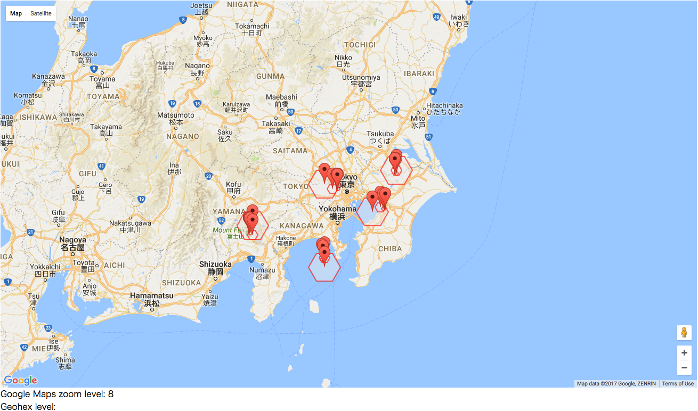

# Geohex level vs Google Maps zoom level

I had to check the zoom level of google maps and geohex.
It's sample project for checking both level between google maps and geohex.

Click map to draw hex using GeoHex.

